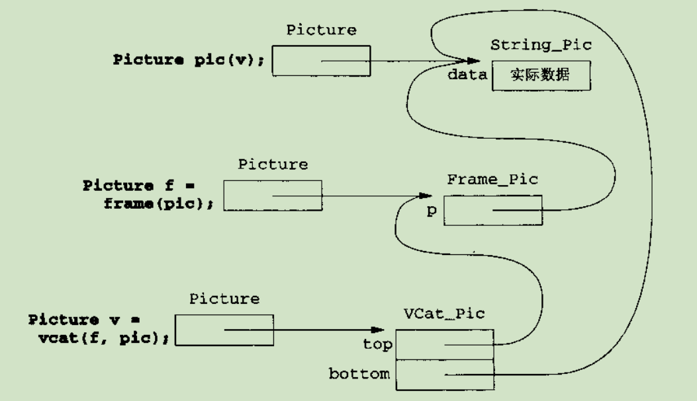

#一个综合例子

#设计
			 |-------String_Pic   //描述用户直接给出的字符图
	Pic_base |----Frame_Pic      //描述加了框的字符图
			 |----HCat_Pic      //描述横向连接的字符图
			 |-----VCat_Pic    //描述纵向连接的字符图
		 
这里没有理由使这个继承关系对用户可见，只给用户提供一个接口类即可。

我们要定义六个类：接口类、基类与四个派生类。   
这里我们把接口类叫做 `Picture` ,并且用 `Ptr` 来组织数据。  
Picture类是一个**为用户设计**的接口类，它只提供接口不提供实现。   

	//只在执行的时候用到的私有类
	class Pic_base {};
	
	class String_Pic : public Pic_base {};
	
	class Frame_Pic : public Pic_base {};
	
	class Vcat_Pic : public Pic_base {};
	
	class Hcat_Pic : public Pic_base {};
	
	//公有接口类与操作
	class Picture {
	public:
		Picture(const std::vector<std::string>& = std::vector<std::string>());
	private:
		Ptr<Pic_base> p;  //Ptr类用来管理引用计数以实现对基础对象的共享
	};

考虑到 `frame` , `hcat`, `vcat` 这三个操作函数都不会改变Picture类型对象的状态，所以不应该定义为成员函数。     
同时不定义为成员函数，将允许传参时的自动转换。

	vector<string> vs;
	Picture p = vs;   //这是可以的，调用的对应的构造函数
	//如果frame是一个成员函数，那么用户就不能把 frame(vs) 写成 vs.frame(），因为vector没有frame成员函数

同时 `hcat(frame(p), p)` 会比 `p.frame().hcat(p)` 更明了    
再者 `hcat` `frame` `vcat` 的函数参数应该具有对称性    

定义为静态函数，或是放在类外面

	class Picture {
	public:
		static Picture frame(const Picture&);
		static Picture hcat(const Picture&, const Picture&);
		static Picture vcat(const Picture&, const Picture&);
		static std::ostream& operator<<(std::ostream&, const Picture&);
	};

###实现Pic_base

	class Pic_base {
		//没有公有接口
		typedef std::vector<std::string>::size_type ht_sz;
		typedef std::string::size_type wd_sz;
	
		virtual wd_sz width() const = 0;
		virtual ht_sz height() const = 0;
		virtual void display(std::ostream&, ht_sz, bool) const = 0;
	};

 
**纯虚函数**， `virtual ... =0`， 定义了纯虚函数的为**抽象类**，**不能实例化**抽象类对象。     

一种完全抽象。    

如果一个派生类定义了所有继承而来的纯虚函数，那么它就是一个**具体类**。但如果还有哪个**纯虚函数**（不是简单的虚函数）没有定义，就__还是__抽象类。

#续
看似  为了计算 `VCat_Pic等类型的对象` 的height，我们需要用到Picture类型的height，想到要在该类中保存一个Picture类型对象，而这又要求在Picture类中提供Pic_base类操作的函数。    

**这种想法是不行的。**    
接口不应该有实现部分，应该取而代之以在该类中保存一个Ptr<Pic_base>类型对象。这样才把接口和实现清除地分开来。

这里只有String_Pic类可以保含实际的字符。其他类存的是一个或者多个Ptr类型对象

	class String_Pic : public Pic_base {
		std::vector<std::string> data;
		String_Pic(const std::vector<std::string>& v) : data(v) {}
	
		//实现纯虚函数
		wd_sz width() const;
		ht_sz height() const;
		void display(std::ostream&, ht_sz, bool) const;
	};
	
	class Frame_Pic : public Pic_base {
		//没有公共接口
		Ptr<Pic_base> p;
		Frame_Pic(const Ptr<Pic_base>& pic):p(pic) {}
	
		//实现纯虚函数
		wd_sz width() const;
		ht_sz height() const;
		void display(std::ostream&, ht_sz, bool) const;
	
	};
	
	class Vcat_Pic : public Pic_base {} {
		Ptr<Pic_base> top, bottom;
		Vcat_Pic(const Ptr<Pic_base>& t, const Ptr<Pic_base>& b) : top(t), bottom(b) {}
	
		//实现纯虚函数
		wd_sz width() const;
		ht_sz height() const;
		void display(std::ostream&, ht_sz, bool) const;
	}
	
	class Hcat_Pic : public Pic_base {} {
		Ptr<Pic_base> left, right;
		Hcat_Pic(const Ptr<Pic_base>& l, const Ptr<Pic_base>& r) : left(l), right(r){}
	
		//实现纯虚函数
		wd_sz width() const;
		ht_sz height() const;
		void display(std::ostream&, ht_sz, bool) const;
	}

注意到 三位一体 的函数都没有，因为交给了 **Ptr类** 和 __标准库类默认函数__ 去处理了

可以在抽象类中定义成员函数，是给派生类继承用的。

**派生类只能访问类的对象自身拥有的保护成员，但是它们没有访问其他对象的保护成员的特权。**
这就是下面Pic_base中加入派生类友元的原因。    
如 `ht_sz Frame_Pic::height() const { return p->height()+4; }`   
Frame_Pic类的这个函数实际上调用了p对象的height成员函数，这是不能访问其他对象的保护成员的。     

逻辑上的理解：如果语法允许一个派生类访问**任何一个同类对象**的保护成员，那么将会破坏这种保护机制。    

如果需要访问某个类中的保护成员的时候，我们可以写一个新的类作为该类的派生类，然后在这个新生成的派生类中定义一个成员函数来访问基类中的保护对象。这么做会破坏类的设计者们最初的保护机制。因此，对保护成员的访问权力仅限于该对象，而不允许其他的对象访问该对象的保护成员。    

#前置声明
有时候会有两个类在定义中互相用到了对方的定义，这时候应该把哪个定义放在前面呢？答：使用前置声明。

	//要避免这种相互依赖，要实现这种类型要无穷大的内存。无法通过编译
	class Dog;
	class Cat{
		Dog d;
	};
	class Dog{
		Cat c;
	};

#完结   

	#ifndef FINAL_H
	#define FINAL_H
	
	#include <vector>
	#include <string>
	#include <algorithm>
	#include "Ptr.h"
	
	//前置声明，防止顺序问题识别不了
	class Pic_base;
	class String_Pic;
	class Frame_Pic;
	class Vcat_Pic;
	class Hcat_Pic;
	class Picture;
	
	
	//只在执行的时候用到的私有类
	class Pic_base {
		friend Picture;
		friend std::ostream& operator<<(std::ostream& os, const Picture& pic);
		friend class String_Pic;
		friend class Frame_Pic;
		friend class Vcat_Pic;
		friend class Hcat_Pic;
	protected:
		//没有公有接口
		typedef std::vector<std::string>::size_type ht_sz;
		typedef std::string::size_type wd_sz;
	
		virtual wd_sz width() const = 0;
		virtual ht_sz height() const = 0;
		virtual void display(std::ostream&, ht_sz, bool) const = 0;
	
	protected:
		static void pad(std::ostream& os, wd_sz beg, wd_sz end) {  //用空格补齐两边
			//end指示的是 最后一列的后一列，C++范围的表示很常用这种
			while (beg != end) {
				os << " ";
				++beg;
			}
		}
	};
	
	class String_Pic : public Pic_base {
		friend Picture;
	
		std::vector<std::string> data;
		String_Pic(const std::vector<std::string>& v) : data(v) {}
	
		//实现纯虚函数
		wd_sz width() const {
			Pic_base::wd_sz n = 0;
			for (Pic_base::ht_sz i = 0; i < data.size(); i++) {
				n = std::max(n, data[i].size());
			}
			return n;
		}
		ht_sz height() const { return data.size(); }
		void display(std::ostream& os, ht_sz row, bool do_pad) const {
			wd_sz start = 0;
			
			//如果row没有超出范围，就输出第row行
			if (row < height()) {
				os << data[row];
				start = data[row].size();
			}
	
			//如果必要的话补齐输出各行
			if (do_pad) {
				pad(os, start, width());
			}
		}
	};
	
	class Frame_Pic : public Pic_base {
		friend Picture;
	
		//没有公共接口
		Ptr<Pic_base> p;
		Frame_Pic(const Ptr<Pic_base>& pic):p(pic) {}
	
		//实现纯虚函数
		wd_sz width() const { return p->width() + 4; }
		ht_sz height() const { return p->height() + 4; }
		void display(std::ostream& os, ht_sz row, bool do_pad) const {
			if (row >= height()) {
				//超出范围
				if (do_pad) {
					pad(os, 0, width());
				}
			}
			else {
				if (row == 0 || row == height() - 1) {
					os << "*";
					os << std::string(width() - 2, '-');
					os << "*";
				}
				else if (row == 1 || row == height()-2) {
					os << "|";
					pad(os, 1, width() - 1);
					os << "|";
				}
				else {
					os << "| ";
					p->display(os, row - 2, true);
					os << " |";
				}
			}
		}
	
	};
	
	class Vcat_Pic : public Pic_base {
		friend Picture;
	
		Ptr<Pic_base> top, bottom;
		Vcat_Pic(const Ptr<Pic_base>& t, const Ptr<Pic_base>& b) : top(t), bottom(b) {}
	
		//实现纯虚函数
		wd_sz width() const {
			return std::max(top->width(), bottom->width());
		}
		ht_sz height() const {
			return top->height() + bottom->height();
		}
		void display(std::ostream& os, ht_sz row, bool do_pad) const {
			wd_sz w = 0;
			if (row < top->height()) {
				//现在处于上面的子图形里
				top->display(os, row, do_pad);
				w = top->width();
			}
			else if (row < height()) {
				//现在处于下面的子图形里
				bottom->display(os, row - top->height(), do_pad);
				w = bottom->width();
			}
	
			if (do_pad) {
				pad(os, w, width());
			}
		}
	};
	
	class Hcat_Pic : public Pic_base {
		friend Picture;
	
		Ptr<Pic_base> left, right;
		Hcat_Pic(const Ptr<Pic_base>& l, const Ptr<Pic_base>& r) : left(l), right(r){}
	
		//实现纯虚函数
		wd_sz width() const {
			return left->width() + right->width();
		}
		ht_sz height() const {
			return std::max(left->height(), right->height());
		}
		void display(std::ostream& os, ht_sz row, bool do_pad) const {
			left->display(os, row, do_pad||row < right->height());
			right->display(os, row, do_pad);
		}
	};
	
	//公有接口类与操作
	class Picture {
		friend std::ostream& operator<<(std::ostream& os, const Picture& pic);
	
	public:
		static Picture frame(const Picture& pic) {
			return new Frame_Pic(pic.p);
			
		}
		static Picture hcat(const Picture& l, const Picture& r) {
			return new Hcat_Pic(l.p, r.p);
		}
		static Picture vcat(const Picture& t, const Picture& b) {
			return new Vcat_Pic(t.p, b.p);
		}
		
	
	public:
		Picture(const std::vector<std::string>& v = std::vector<std::string>()) :p(new String_Pic(v)) {}
	private:
		Ptr<Pic_base> p;
		Picture(Pic_base* ptr) : p(ptr) {}
	};
	
	std::ostream& operator<<(std::ostream& os, const Picture& pic) {
		const Pic_base::ht_sz ht = pic.p->height();
		for (Pic_base::ht_sz i = 0; i < ht; i++) {
			pic.p->display(os, i, false);
			os << std::endl;
		}
		return os;
	}
	
	#endif // !FINAL_H
